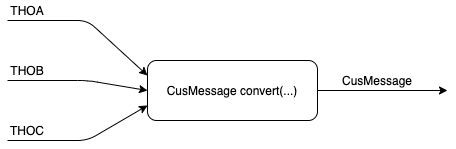

# ConverterProject
## Small Java Example Project on Writing Converter Classes

ToDos:
* Es sollen die Nachrichtentypen THOA, THOB und THOC angemessen durch Klassen wie im Ticket POGO-95002 repräsentiert werden.
* Es soll eine (oder mehrere) Methode(n) im THOMessageConverter implementiert werden, die aus Objekten, die Nachrichten vom Typ THOA, THOB oder THOC darstellen, jeweils ein möglichst ausführlich gefülltes CusMessage Object erzeugt.
  
